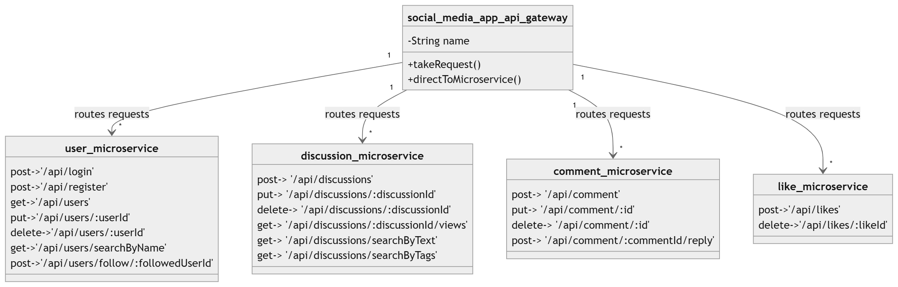
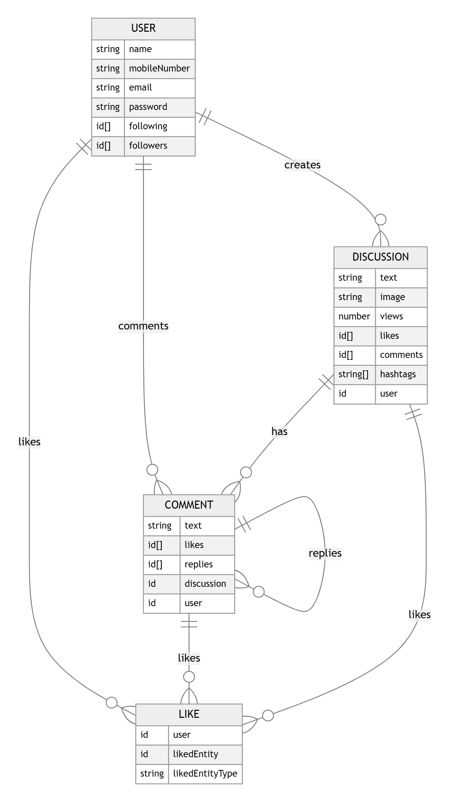

# Social Media App (Microservices Based Architecture)

## Project Description

This project implements a RESTful API in Node.js for managing users, discussions, comments, likes, and related operations.

## Architecture Diagram



## ER Diagram



## Testing APIs

You can find public link to the Postman collection for testing the APIs here: [Postman Collection Public Link](https://www.postman.com/vinay-tare/workspace/social-media-app-microservices-based/collection/36431559-273343e7-b5a7-4f56-aeb0-2193897a2efb?action=share&creator=36431559)

## API Documentation

```
**Note:** For all APIs except `/userService/api/login` and `/userService/api/register`, include a statement indicating that a valid JWT token is required in each request for authentication and authorization purposes.
```

### Authentication

#### POST /userService/api/login

Authenticates a user and returns a token upon successful login.

Request Body

```json
{
  "email": "string",
  "password": "string"
}
```

**Response**

```json
{
  "token": "string",
  "message": "Login successful"
}
```

#### POST /userService/api/register

Registers a new user.

**Request Body**

```json
{
  "name": "string",
  "mobileNumber": "string",
  "email": "string",
  "password": "string"
}
```

**Response**

```json
{
  "message": "User registered successfully!",
  "user": {
    "_id": "ObjectId",
    "name": "string",
    "mobileNumber": "string",
    "email": "string",
    "following": [],
    "followers": [],
    "createdAt": "Date",
    "updatedAt": "Date"
  }
}
```

### User Management

#### GET /userService/api/users

Retrieves a list of all users.

**Response**

```json
{
  "message": "List of all users",
  "users": [ User ]
}
```

#### PUT /userService/api/users/:userId

Updates user details.

**Request Params**

- userId: ObjectId

**Request Body**

```json
{
  "name": "string",
  "mobileNumber": "string",
  "email": "string"
}
```

**Response**

```json
{
  "message": "User details updated",
  "user": User
}
```

#### DELETE /userService/api/users/:userId

Deletes a user.

**Request Params**

- userId: ObjectId

**Response**

```json
{
  "message": "User deleted",
  "user": User
}
```

#### GET /userService/api/users/searchByName

Searches users by name.

**Query Param**

- name: string

**Response**

```json
{
  "message": "Users found with name ${name}",
  "users": [ User ]
}
```

#### POST /userService/api/users/follow/:followedUserId

Follows another user.

**Request Params**

- followedUserId: ObjectId

**Response**

```json
{
  "message": "User followed successfully!"
}
```

### Discussion Management

#### POST /discussionService/api/discussions

Creates a new discussion.

**Request Body**

```json
{
  "content": "string",
  "image": "string (optional)",
  "tags": ["string"] (optional)
}
```

**Response**

```json
{
  "message": "Discussion started successfully",
  "discussion": Discussion
}
```

#### PUT /discussionService/api/discussions/:discussionId

Updates a discussion.

**Request Params**

- discussionId: ObjectId

**Request Body**

```json
{
  "content": "string",
  "image": "string (optional)",
  "tags": ["string"] (optional)
}
```

**Response**

```json
{
  "message": "Discussion updated successfully",
  "discussion": Discussion
}
```

#### DELETE /discussionService/api/discussions/:discussionId

Deletes a discussion.

**Request Params**

- discussionId: ObjectId

**Response**

```json
{
  "message": "Discussion deleted successfully"
}
```

#### GET /discussionService/api/discussions/:discussionId/views

Retrieves the view count of a discussion.

**Request Params**

- discussionId: ObjectId

**Response**

```json
{
  "views": number
}
```

#### GET /discussionService/api/discussions/searchByText

Searches discussions by text.

**Query Param**

- searchText: string

**Response**

```json
{
  "message": "Discussions based on text: ${searchText}",
  "discussions": [ Discussion ]
}
```

#### GET /discussionService/api/discussions/searchByTags

Searches discussions by tags.

**Query Param**

- searchTags: string

**Response**

```json
{
  "message": "Discussions with tags: ${searchTags}",
  "discussions": [ Discussion ]
}
```

### Comment Management

#### POST /commentService/api/comment

Creates a new comment on a discussion.

**Request Body**

```json
{
  "content": "string",
  "discussionId": "ObjectId"
}
```

**Response**

```json
{
  "message": "Comment created successfully!"
}
```

#### PUT /commentService/api/comment/:id

Updates a comment.

**Request Params**

- id: ObjectId

**Request Body**

```json
{
  "content": "string"
}
```

**Response**

```json
{
  "message": "Comment updated successfully!",
  "updatedComment": Comment
}
```

#### DELETE /commentService/api/comment/:id

Deletes a comment.

**Request Params**

- id: ObjectId

**Response**

```json
{
  "message": "Comment deleted successfully!"
}
```

#### POST /commentService/api/comment/:commentId/reply

Replies to a comment.

**Request Params**

- commentId: ObjectId

**Request Body**

```json
{
  "content": "string"
}
```

**Response**

```json
{
  "message": "Reply added successfully!",
  "parentComment": Comment
}
```

### Like Management

#### POST /likeService/api/likes

Adds a like to a discussion or comment.

**Request Body**

```json
{
  "likedEntityId": "ObjectId",
  "likedEntityType": "Discussion" | "Comment"
}
```

**Response**

```json
{
  "message": "Like added",
  "like": Like
}
```

#### DELETE /likeService/api/likes/:likeId

Removes a like from a discussion or comment.

**Request Params**

- likeId: ObjectId

**Response**

```json
{
  "message": "Like removed"
}
```

## Models

### User Model

```javascript
{
  "_id": "ObjectId",
  "name": "String",
  "mobileNumber": "String",
  "email": "String",
  "password": "String",
  "following": [ { "_id": "ObjectId", "name": "String" } ],
  "followers": [ { "_id": "ObjectId", "name": "String" } ],
  "createdAt": "Date",
  "updatedAt": "Date"
}
```

### Discussion Model

```javascript
{
  "_id": "ObjectId",
  "content": "String",
  "image": "String",
  "views": "Number",
  "likes": [ { "_id": "ObjectId", "user": "ObjectId" } ],
  "comments": [ { "_id": "ObjectId", "user": "ObjectId", "content": "String" } ],
  "hashtags": [ "String" ],
  "user": { "_id": "ObjectId", "name": "String" },
  "createdAt": "Date",
  "updatedAt": "Date"
}
```

### Comment Model

```javascript
{
  "_id": "ObjectId",
  "content": "String",
  "likes": [ { "_id": "ObjectId", "user": "ObjectId" } ],
  "replies": [ { "_id": "ObjectId", "user": "ObjectId", "content": "String" } ],
  "discussion": { "_id": "ObjectId", "content": "String" },
  "user": { "_id": "ObjectId", "name": "String" },
  "createdAt": "Date",
  "updatedAt": "Date"
}
```

### Like Model

```javascript
{
  "_id": "ObjectId",
  "user": { "_id": "ObjectId", "name": "String" },
  "likedEntity": "ObjectId",
  "likedEntityType": "String",
  "createdAt": "Date"
}
```

## Technologies Used

- Node.js
- Express.js
- MongoDB (mongoose)
- JavaScript (ES6+)

## Installation

1. Clone the repository.
2. Install dependencies: `npm install` for each mircroservice and the api gateway.
3. Set up environment variables for each microservices and api gateway.
4. Start the server: Run `npm start` for each microservices (first), then for the api gateway.

## Authors

Vinay Tare

## License

This project is licensed under the MIT License - see the LICENSE file for details.
